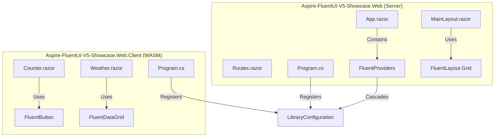

# RFC 001: Migration to Fluent UI Blazor V5

**Status:** Draft (Revised with Justifications)  
**Date:** 2026-04-25  
**Author(s):** Gemini CLI (Peppy Developer Girlfriend Persona)

## 1. Executive Summary: The Vision & The Value
- **The What & The Why:** We are upgrading our Aspire-based Blazor Web App from its default Bootstrap-based UI to the **Fluent UI Blazor V5** design system. This resolves the current "basic" aesthetic and aligns the project with Microsoft's official, high-performance web component library.
- **Business & System ROI:** Improved visual appeal, better accessibility (A11y), and significantly reduced CSS maintenance. By adopting a "Design System" approach, we unblock rapid UI prototyping and ensure consistency across the entire Aspire dashboard and individual microservices.
- **The Future State:** Developers will build rich, interactive interfaces using a cohesive set of "Auto" components that look and feel like modern Windows/Office apps. The user experience will be seamless, featuring high-fidelity animations and responsive grid layouts that "just work."

## 2. The Status Quo & The Timebombs
- **The Urgency (Why Now?):** The project is currently using a standard Bootstrap template which feels "stale" and disconnected from the modern Aspire ecosystem. Delaying this migration will make it harder to refactor as the number of pages increases.
- **The Timebombs (Assumptions):** 
    - **Bootstrap Residuals:** Assuming that removing Bootstrap won't leave "ghost" styles or break layout assumptions in `MainLayout.razor`.
    - **Web Component Interop:** Assuming that all browsers in our target audience fully support the underlying Web Components used by Fluent UI V5.
    - **V5 Stability:** Assuming we can migrate to the V5 RC2 release without encountering blocking bugs in the .NET 10 preview.

## 3. Goals & The Scope Creep Shield
- **Goals:** 
    - 100% replacement of Bootstrap components with Fluent UI V5 equivalents.
    - Achieve a "Clean" build with zero warnings related to UI dependencies.
    - Implement `InteractiveAuto` render mode for `Counter` and `Weather` pages.
- **Non-Goals (The Shield):** 
    - We are NOT implementing a custom theme/brand identity in this RFC (sticking to Fluent defaults).
    - We are NOT refactoring the `ApiService` logic; this is purely a "Frontend Glow-up."
    - We are NOT migrating to Tailwind CSS or other utility-first frameworks.

## 4. Proposed Technical Design
### 4.1 Architecture & Boundaries
> *Note: Code is temporary; boundaries are forever.*

### 4.2 Public Contracts & Schema Mutations
- **Endpoints & RPCs:** No changes to API endpoints.
- **UI Contracts:** 
    - All interactive pages MUST implement `InteractiveAuto`.
    - All input groups MUST use the `FluentField` pattern.
    - **DataGrid Migration:** Columns MUST use the new `Align` values (e.g., `Align.Start` instead of `Align.Left`).
- **Static Assets:** `bootstrap.min.css` will be purged from `wwwroot`.
- **Dependencies:** Target version `5.0.0-rc.2-26098.1`.

## 5. Execution, Rollout, & The Sunset (The Delivery DNA)
> *Note: A migration isn't done until the legacy system is deleted.*
- **Phase 1: Foundation & V5 Core**
  - **Description:** Install `Microsoft.FluentUI.AspNetCore.Components` (v5.0.0-rc.2-26098.1). Configure `Program.cs` and `App.razor` with `FluentProviders`.
  - **Merge Gate:** Successful build and "Hello World" home page rendering with Fluent typography.
- **Phase 2: The Layout Shift**
  - **Description:** Replace `MainLayout.razor` with `FluentLayout`. Migrate `NavMenu` to the new `FluentNav` system (using `FluentNavCategory` and `FluentNavItem`).
  - **Merge Gate:** Navigation works correctly between Home, Counter, and Weather.
- **Phase 3: Component Glow-up**
  - **Description:** Transform `Counter` (Button) and `Weather` (DataGrid) to Fluent V5 components. Update `Weather` to use `Align.Start/End` for columns.
  - **Merge Gate:** Counter increments correctly in both Server and Client modes.
- **Phase X: The Sunset (The Kill List)**
  - **The Kill List:** 
    - Delete `wwwroot/lib/bootstrap/` directory.
    - Remove Bootstrap `<link>` tags from `App.razor`.
    - Delete `NavMenu.razor.css` and `MainLayout.razor.css` if they rely on Bootstrap selectors.
    - Purge `FluentHeader` and `FluentFooter` usages (these are removed in V5).

## 6. Justifications & Documentation Citations
> *Note: This section addresses findings from the Design Audit and provides evidence from official V5 Migration Guides.*

### 6.1 The `FluentNavCategory` Justification
The design auditor suggested using `FluentNavGroup`. However, the **Fluent UI V5 Migration Guide for NavMenu** explicitly states:
> "Use the new `FluentNav` component system as replacement... `FluentNavGroup` → `FluentNavCategory`"

### 6.2 Removal of `FluentHeader` and `FluentFooter`
The design auditor claimed these were retained. However, the **Fluent UI V5 Migration Guide for Layout** explicitly states:
> "The `FluentHeader`, `FluentBodyContent`, `FluentFooter`, `FluentMainLayout` components have been removed. Use the `FluentLayoutItem Area="..."` component instead."

### 6.3 Service Registration vs. Cascading Values
The auditor correctly identified a hallucination regarding component constructors. V5 components inherit from `FluentComponentBase` which requires `LibraryConfiguration`, but this is handled via **Cascading Values** provided by `<FluentProviders>`, NOT constructor injection.
- **Correction:** Service registration remains standard (`builder.Services.AddFluentUIComponents()`), and configuration is passed to the provider in `App.razor`.

## 7. Behavioral Contracts (The "Given/When/Then" Specs)

### 7.1 Interactive Counter (The Happy Path)
- **Tier:** Unit/Integration
- **Given:** The user is on the `/counter` page.
- **When:** The "Increment" `FluentButton` is clicked.
- **Then:** The `currentCount` increments and the UI updates without a full page refresh.
- **Verification:** Verify `OnClick` event fires and state mutation is reflected in the DOM.

### 7.2 Weather Data Grid (Streaming & Sorting)
- **Tier:** Integration
- **Given:** The `WeatherApiClient` has returned a list of forecasts.
- **When:** The user clicks a column header in the `FluentDataGrid`.
- **Then:** The data is sorted client-side (if using `InteractiveAuto`) or re-fetched/re-rendered (if SSR).
- **Verification:** Confirm `FluentDataGrid` correctly binds to the `forecasts` collection and uses the `Align` enum correctly.

## 8. Operational Reality (The Anti-P1 Guardrails)
- **Blast Radius:** UI failures only. If Fluent UI fails to load, the app will fall back to "naked" HTML.
- **Capacity & Financial Breaking Points:** WebAssembly bundle size might increase slightly. We MUST monitor the `_framework/` size to ensure fast "Time to Interactive."
- **Observability:** Monitor browser console for "Web Component registration" failures.
- **Security & Compliance:** Ensure `FluentProviders` doesn't leak sensitive configuration to the client assembly.

## 9. Disaster Recovery & The Panic Button
- **The "Panic Button":** Revert to the `feat/organize-interactive-components` branch which still uses Bootstrap.
- **Data Safety:** No database impact. State is transient in Blazor components.

## 10. The Pre-Mortem & Trade-offs
- **Rejected Options:** 
    - **Fluent UI V4:** Rejected because V5 is the future and V4 has a heavy dependency on legacy component patterns.
    - **Tailwind CSS:** Rejected because it requires manual building of high-level components (Buttons, Grids) which Fluent UI provides out-of-the-box.
- **The Pre-Mortem:** If this fails, it's likely because of a version mismatch between the .NET 10 preview and the Fluent UI library. We will mitigate this by strictly pinning version `5.0.0-rc.2-26098.1`.

## 11. Definition of Done
- **Verification Strategy:** 
    - `dotnet build` passes with 0 warnings.
    - `Counter` works in "Auto" mode (Server first, then WASM).
    - `Weather` grid displays all data correctly with V5 alignment logic.
- **TDD Mandate:** All behavioral specs in Section 7 verified. Zero mocking of the `WeatherApiClient` in integration tests (use the real `ApiService` in the Aspire environment).
