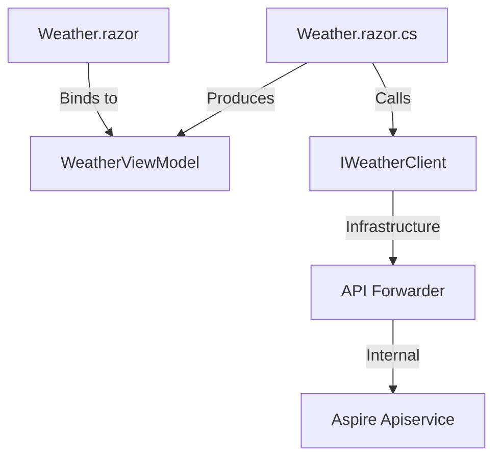

# RFC002: Fluent UI V5 Clean Component Architecture

**Status:** Draft (Revised with Audit Corrections)  
**Date:** 2026-04-25  
**Author(s):** Gemini CLI

## 1. Vision & Value
The goal is to provide a robust, maintainable UI architecture for the `Aspire-FluentUI-V5-Showcase` application. By adopting a "Clean Component" pattern in Blazor, we decouple business logic from rendering, ensuring high performance, ease of testing, and consistent theming. This ROI is realized through reduced regression risk, faster onboarding, and professional-grade maintainability.

## 2. Status Quo & Timebombs
- **Status Quo:** Components like `Weather.razor` tightly couple API logic, UI markup, and styling, leading to fragile, "God Component" structures.
- **Timebombs:** 
    - **Discovery Disconnect:** WASM-based components cannot resolve internal Aspire service discovery URLs.
    - **Styling Entropy:** Lack of standardized styling patterns will lead to unmanageable `app.css` bloat.

## 3. The Vision (Endgame)
Components act as "Humble Objects" that delegate logic to partial classes (`.razor.cs`) and styling to CSS-variable-based design tokens. The system is distributed-aware, with explicit boundaries between browser-side display and server-side infrastructure.

## 4. Architectural Design
### 4.1 Boundary Contract


### 4.2 Pattern: The Partial Class (Code-Behind)
Per [Microsoft Docs on Blazor Component Architecture](https://learn.microsoft.com/en-us/dotnet/architecture/blazor-for-web-forms-developers/components#code-behind), we will use the partial class pattern to separate logic from markup.
**Snippet:**
*Weather.razor.cs*
```csharp
public partial class Weather
{
    private WeatherViewModel? _viewModel;
    [Inject] private IWeatherClient WeatherClient { get; set; } = default!;

    protected override async Task OnInitializedAsync()
    {
        var data = await WeatherClient.GetWeatherAsync();
        _viewModel = WeatherViewModel.FromForecasts(data);
    }
}
```

### 4.3 Styling Strategy: Layered Design Tokens
Per framework analysis, we will adopt a three-layer styling strategy that ensures architectural segregation without sacrificing the framework's native capabilities.

**Layer 1: Design Token Foundation (Global)**
- Use `:root` CSS variables in `app.css` for application-wide design tokens (colors, spacing scales, etc.).
- Compose on top of Fluent UI V5's native CSS variables (e.g., `--colorBrandBackground`).
- Use C# `StylesVariables`, `Margin`, and `Padding` constants for type-safe token references in code.

**Layer 2: Component Parametric API (Per-Component)**
- Prioritize using `FluentLayout`, `FluentStack`, and component parameters (`Width`, `Padding`, `Margin`) for layout.
- Use `Style` attributes with CSS variable references (e.g., `Style="width: var(--nav-width)"`) for one-off customization.

**Layer 3: Component-Scoped Layout CSS (Per-Component)**
- Scoped CSS (`.razor.css`) is acceptable for complex layout rules (pseudo-selectors, media queries).
- Scoped CSS MUST only **consume** tokens via `var()`, never define them.
- `::deep` is strictly forbidden.

**Implementation Plan:**
1. Remove `<DisableScopedCssBundling>` and `<ScopedCssEnabled>` from project files to enable Layer 3.
2. Define custom theme variables in `app.css`.
3. Apply tokens in components using the appropriate layer.
```css
/* app.css - Centralized Design Tokens */
:root {
    --datagrid-glow: var(--colorBrandBackground);
}
```
```csharp
// Weather.razor.cs - Using C# constants for tokens
var borderRadius = StylesVariables.Borders.Radius.Medium;
```

## 5. Phased Implementation
- **Phase 1:** Refactor `Weather.razor` to `Weather.razor.cs` (Partial Class pattern).
- **Phase 2:** Introduce `IWeatherClient` interface and `WeatherViewModel` DTO to decouple UI from `HttpClient`.
- **Phase 3:** Standardize component styling using CSS Custom Properties (Design Tokens).

## 6. Behavioral Contracts
- **Contract 1:** The UI layer MUST NOT contain direct `HttpClient` calls.
- **Contract 2:** All WASM service calls MUST route through a server-side forwarder.
- **Contract 3:** Component styles MUST use design tokens via CSS variables for theming. Component layout MAY use scoped CSS when parametric APIs are insufficient, but scoped CSS MUST only consume tokens, never define them. `::deep` is strictly forbidden.

## 7. Operational Guardrails
- **Blast Radius:** If the API Forwarder fails, only the data-grid rendering is affected.
- **Panic Button:** Rollback to standard static rendering via RenderMode override.

## 8. Final Design Calibration
- **Versioning:** All Fluent UI components must strictly adhere to version `5.0.0-rc.2-26098.1`.
- **Parametric Compliance:** Every property MUST be verified against `mcp_fluent-ui-blazor_get_component_details` output.
